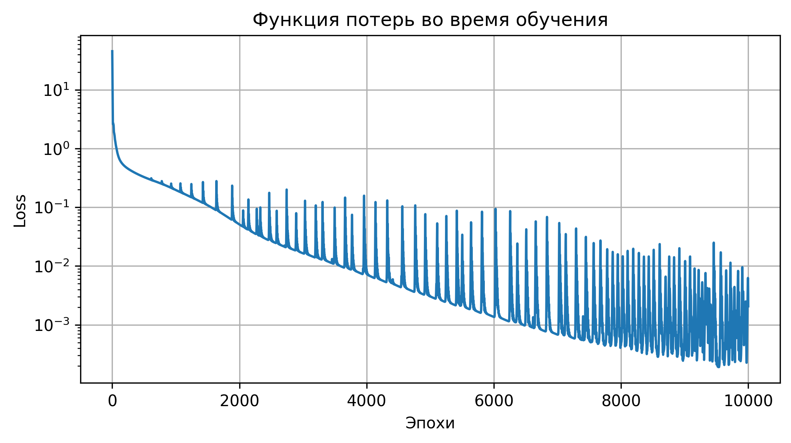

# Проект: Исследование влияния вида задачи для уравнения гармонического осциллятора на решение PINN

## Описание
Цель данного проекта — исследование влияния различных формулировок задачи Коши для уравнения гармонического осциллятора с вынуждающей силой на точность и эффективность метода физически-информированных нейронных сетей (PINN).

## Постановка задачи
Рассматриваются три различных формулировки задачи:

1. **ОДУ второго порядка:**
   $$
   \begin{cases}
   \frac{d^2x}{dt^2} + \omega_0^2 x = -A\cos(\omega t) \\
   x(0) = x_0 \\
   \frac{dx}{dt}(0) = v_0
   \end{cases}
   $$

2. **Система ОДУ первого порядка:**
   $$
   \begin{cases}
   \frac{dx}{dt} = y \\
   \frac{dy}{dt} = -\omega_0^2 x - A\cos(\omega t) \\
   x(0) = x_0 \\
   y(0) = v_0
   \end{cases}
   $$

3. **Альтернативная система ОДУ первого порядка:**
   $$
   \begin{cases}
   \frac{dx}{dt} = \omega_0 y - \frac{A}{\omega} \sin(\omega t) \\
   \frac{dy}{dt} = -\omega_0 x \\
   x(0) = x_0 \\
   y(0) = \frac{v_0}{\omega_0}
   \end{cases}
   $$

## Методология
Для исследования используется метод физически-информированных нейронных сетей (PINN). Основные этапы реализации:

1. Выбор архитектуры нейронной сети.
2. Формулировка функционала потерь, включающего:
   - Физические ограничения (уравнения движения).
   - Начальные условия.
3. Решение задачи для каждой формулировки.
4. Сравнительный анализ точности и эффективности (сравнение времени работы программы и потерь).

## Результаты
На основании проведённых экспериментов были получены следующие результаты:

- **ОДУ второго порядка:** Быстрая сходимость, меньшее число итераций. 
- **Система ОДУ первого порядка:** Более высокая точность на тестовых данных. 
- **Альтернативная система ОДУ:** Схожие результаты, но увеличенное время вычислений. 

## Используемые технологии
- **Язык программирования** Python.
- **Интерактивная оболочка** IPython.
- **Фреймворки:** PyTorch.
- **Инструменты для анализа данных:** NumPy, Matplotlib, tqdm.

## Список литературы
1. Lagaris I.E., Likas A., Fotiadis D.I. Artificial neural networks for solving ordinary and partial differential equations. //IEEE Transactions on Neural Networks, 1998. T. 9. № 5. С. 987–1000.
2. Raissi M., Perdikaris P., Karniadakis G.E. Physics-informed neural networks: A deep learning framework for solving forward and inverse problems involving nonlinear partial differential equations. //Journal of Computational Physics, 2019. T. 378. С. 686–707.
3. [PyTorch documentation](https://pytorch.org/docs/stable/index.html).
4. [TensorFlow documentation](https://www.tensorflow.org/api_docs).
5. [PyKAN GitHub Repository](https://kindxiaoming.github.io/pykan/).

## Запуск проекта

1. Клонировать репозиторий:
   ```bash
   git clone <https://github.com/PracticalOscillations/Practice3.git>
   ```
2. Установить зависимости:
   ```bash
   pip install -r requirements.txt
   ```
3. Запустить python notebook файлы. У вас может возникать странная ошибка это значит, что видеокарта переполнена. В этом случае попробуйте уменьшить количество эпох.